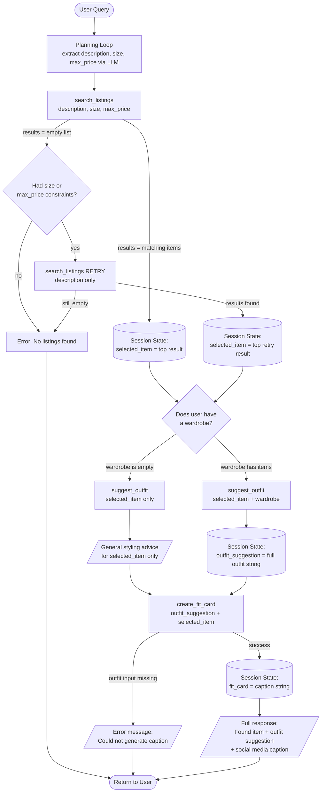

# FitFindr 

FitFindr is a multi-tool AI agent that helps users find secondhand pieces and figure out how to wear them. The agent orchestrates a set of tools in response to a natural language request — searching listings, evaluating fit against an existing wardrobe, and generating a shareable outfit description — while handling the messy reality of what happens when a tool fails or returns nothing useful.

## Tools

### Tool 1: search_listings

**What it does:**
Searches the mock listings database for clothing items matching the user's request. Filters by price and size, then ranks remaining results by keyword overlap with the description.

**Input parameters:**
- `description` (str): A short phrase describing the item the user is looking for (e.g., `"vintage graphic tee"`). Matched against listing titles, descriptions, style tags, and categories.
- `size` (str | None): Size string to filter by, case-insensitive (e.g., `"M"` matches `"S/M"`). Pass `None` to skip size filtering.
- `max_price` (float | None): Price ceiling, inclusive (e.g., `30.0`). Pass `None` to skip price filtering.

**What it returns:**
A list of matching listing dicts sorted by relevance score (highest first). Each dict contains:
- `id` (str), `title` (str), `description` (str), `category` (str)
- `style_tags` (list[str]), `colors` (list[str])
- `size` (str), `condition` (str), `price` (float)
- `brand` (str), `platform` (str)

Returns an empty list if nothing matches — never raises an exception.

**What happens if it fails or returns nothing:**
The agent detects the empty list, then automatically retries once with loosened constraints (drops `size` and `max_price` from the search). If the retry also returns nothing, the agent sets `session["error"]` to a descriptive message and returns early without calling the other tools.

---

### Tool 2: suggest_outfit

**What it does:**
Given a thrifted item and the user's current wardrobe, generates 1–2 complete outfit suggestions using an LLM (Groq llama-3.3-70b-versatile). Falls back to general styling advice when the wardrobe is empty.

**Input parameters:**
- `new_item` (dict): The listing dict for the item the user is considering buying (same structure as a `search_listings` result — includes `title`, `style_tags`, `colors`, `category`).
- `wardrobe` (dict): A wardrobe dict with an `"items"` key holding a list of wardrobe item dicts. Each wardrobe item has `id`, `name`, `category`, `colors` (list[str]), `style_tags` (list[str]), and optional `notes`. The `"items"` list may be empty.

**What it returns:**
A non-empty string. If the wardrobe has items, returns 1–2 specific outfit combinations naming actual wardrobe pieces. If the wardrobe is empty, returns general styling advice describing what kinds of items pair well with the new piece and what overall vibe it suits.

**What happens if it fails or returns nothing:**
If the wardrobe is empty, the tool switches to a general-advice prompt automatically — it never returns an empty string or raises an exception.

---

### Tool 3: create_fit_card

**What it does:**
Generates a 2–4 sentence Instagram/TikTok-style caption for the thrifted outfit. Uses a higher LLM temperature (1.2) so the output feels casual, authentic, and different each time.

**Input parameters:**
- `outfit` (str): The outfit suggestion string returned by `suggest_outfit`.
- `new_item` (dict): The listing dict for the thrifted item. Used to pull `title`, `price`, and `platform` into the caption naturally.

**What it returns:**
A 2–4 sentence string usable as a social media caption. Mentions the item name, price, and platform once each, captures the outfit vibe in specific terms.

**What happens if it fails or returns nothing:**
If `outfit` is an empty or whitespace-only string, the tool returns `"Could not generate a caption, no outfit suggestion was provided."` — it never raises an exception.

---

## Planning Loop

After taking in the original user prompt, the agent uses an LLM to extract structured search parameters (description, size, max_price) from natural language. It then calls `search_listings` with those parameters.

**Conditional logic:**

1. **If `search_listings` returns no results:** The agent checks whether `size` or `max_price` were part of the original query. If so, it automatically retries `search_listings` with only `description` (dropping both constraints), and tells the user what was adjusted. If the retry also returns nothing, the agent stops and returns an error — it does not call `suggest_outfit` or `create_fit_card`.

2. **If `search_listings` returns results:** The agent selects the top-scoring item and calls `suggest_outfit` with it and the user's wardrobe.

3. **If the wardrobe is empty:** `suggest_outfit` returns general styling advice rather than outfit combinations. The agent still calls `create_fit_card` after, since `suggest_outfit` always returns a non-empty string.

4. **If the wardrobe has items:** `suggest_outfit` returns 1–2 specific outfit combinations, then `create_fit_card` is called to generate a caption. This is the happy path.

The agent knows it is done when `create_fit_card` returns (success) or when any step sets `session["error"]` (early exit).

---

## State Management

All state for one interaction lives in a single session dict initialized at the start of `run_agent()`. No state is re-entered by the user between tool calls — everything flows forward through this dict.

| Field | Type | Stored when | Passed to |
|---|---|---|---|
| `query` | str | Immediately (user input) | LLM parse prompt |
| `parsed` | dict | After LLM parses query | `search_listings` args |
| `search_results` | list[dict] | After `search_listings` | Selecting `selected_item` |
| `selected_item` | dict | After selecting top result | `suggest_outfit`, `create_fit_card` |
| `wardrobe` | dict | Immediately (user input) | `suggest_outfit` |
| `outfit_suggestion` | str | After `suggest_outfit` | `create_fit_card` |
| `fit_card` | str | After `create_fit_card` | Final output |
| `error` | str or None | On any early exit | Returned to caller |

`session["search_results"][0]` becomes `session["selected_item"]` — the user never re-enters the item. `session["outfit_suggestion"]` is passed directly into `create_fit_card` without re-entry.

---

## Error Handling

| Tool | Failure mode | Agent response |
|------|-------------|----------------|
| `search_listings` | No results match the query | Agent retries once with loosened constraints (drops size and max_price). If retry also returns nothing, sets `session["error"]` to `"Sorry, I couldn't find any items that matched your description. Please try again or ask for something else."` and returns early — `suggest_outfit` and `create_fit_card` are never called. |
| `suggest_outfit` | Wardrobe is empty | Returns a non-empty string with general styling advice for the item. The agent continues normally and calls `create_fit_card` with this advice. |
| `create_fit_card` | `outfit` input is empty or whitespace | Returns `"Could not generate a caption, no outfit suggestion was provided."` — no exception is raised. |

**Concrete example from testing:**

Running `run_agent("designer ballgown size XXS under $5", wardrobe)` triggers the `search_listings` failure path. The agent first tries with all parameters, gets an empty list, then retries dropping `size="XXS"` and `max_price=5.0`. If the retry still returns nothing, `session["error"]` is set and the agent returns immediately. The narrated test in `tests/test_agent_narrated.py` demonstrates this path explicitly.

---

## Architecture



---

## AI Tool Plan

**Milestone 3 — Individual tool implementations:**

I used Claude Code to help implement and debug the tools. Two specific examples:

**Example 1 — search_listings filtering:**

I said: "I'm making the search_listings tool in @tools.py, and I'm wondering how to safely remove the items from the database during iteration."

Claude responded: "You don't need to remove items during iteration — that's where bugs creep in. Instead, build a new filtered list using a list comprehension, then score what's left:

```python
listings = load_listings()

# Filter first, no mutation
filtered = [
    item for item in listings
    if (max_price is None or item["price"] <= max_price)
    and (size is None or size.lower() in item["size"].lower())
]
```

Then score and sort the filtered list separately. You never touch the original listings."

I read the snippet, understood the filter-then-score pattern, ran the three unit tests in `tests/test_tools.py` against it, and confirmed the price filter and empty-result cases both passed before moving on.

**Example 2 — run_agent robustness:**

I said: "Are there any bugs or things to look out for in run_agent?"

It responded with: "Three things to fix or watch out for:

Line 140 — the error stub needs to be removed, not just commented out. You return the session right after, which is correct, but the commented line is dead weight. Delete it.

Line 119 — json.loads will crash if the LLM adds extra text around the JSON. LLMs sometimes prefix the response with something like "Here is the JSON:" even when told not to. Wrap it in a try/except:

```python
try:
    parsed = json.loads(response.choices[0].message.content)
except json.JSONDecodeError:
    session["error"] = "Failed to parse your query. Please try rephrasing it."
    return session
```

Line 135 — you pass wardrobe directly but the session already stores it as session["wardrobe"]. These are the same value here so it works, but for consistency it's cleaner to use session["wardrobe"] so everything flows through session state as designed.
Everything else — the early return on no results, storing each tool output in session, the tool call order — is correct and matches your planning.md spec."

**Milestone 4 — Planning loop and state management:**

I used Claude Code to review the planning loop logic after implementing it. I asked: "Does the planning loop in agent.py match the conditional logic described in planning.md?" Claude confirmed the early-exit on empty search results and the wardrobe-empty branch both matched the spec, and pointed out that the retry logic I later added should be documented in planning.md as a divergence from the original spec. I then updated both planning.md and README accordingly.

---

## Spec Reflection

**One way the spec helped:**

Defining the state management table (what is stored, when, and how it flows) before writing `run_agent()` made the implementation nearly mechanical. Having named fields like `session["selected_item"]` and `session["outfit_suggestion"]` already decided meant I never had to ask "where does this value come from?" while coding — I just read the field.

**One divergence from the spec and why:**

The original spec had the agent stop immediately when `search_listings` returned an empty list. During testing I found that including `size` and `max_price` in the query often produced zero results for legitimate items (e.g., a user asking for size M but the database stores "S/M"). The spec didn't anticipate this, so I added a retry step that drops those constraints and retries with description only — a behavior that makes the agent significantly more useful without changing the happy-path flow at all.

---

## A Complete Interaction (Step by Step)

**Example user query:** "I'm looking for a vintage graphic tee under $30. I mostly wear baggy jeans and chunky sneakers. What's out there and how would I style it?"

**Step 1 — Parse query:**
The LLM extracts `description="vintage graphic tee"`, `size=null`, `max_price=30.0` from the natural language query and stores them in `session["parsed"]`.

**Step 2 — search_listings:**
`search_listings("vintage graphic tee", None, 30.0)` is called. It loads all listings, drops those over $30, then scores remaining items by keyword overlap with "vintage graphic tee". Items with a score of 0 are dropped. The top result — *Graphic Tee — 2003 Tour Bootleg Style* ($22.00) — is stored in `session["search_results"]` and `session["selected_item"]`.

**Step 3 — suggest_outfit:**
`suggest_outfit(selected_item, wardrobe)` is called. The wardrobe has 10 items, so the LLM receives a prompt listing the new tee plus the wardrobe and asks for 1–2 complete outfit combinations. The response (naming specific wardrobe pieces) is stored in `session["outfit_suggestion"]`.

**Step 4 — create_fit_card:**
`create_fit_card(outfit_suggestion, selected_item)` is called. The LLM generates a 2–4 sentence caption mentioning the item name, $22 price, and platform. The caption is stored in `session["fit_card"]`.

**Final output to user:**
The app displays: the found listing (title, price, platform, condition), the outfit suggestion (naming wardrobe pieces), and the social media caption.

```
Found: Graphic Tee — 2003 Tour Bootleg Style
Price: $22.00 | Platform: depop | Condition: good

Outfit suggestion:
  Outfit 1: Pair the tee with your Vintage Levi's 501 Jeans and White Canvas
  Sneakers for a classic streetwear look. Add the Crossbody Bag for a clean finish.

Fit card:
  found this 2003 tour tee on depop for $22 and i cannot stop wearing it 🎸
  paired it with my levi's and canvas sneakers and it just works.
  vintage streetwear never misses.
```
