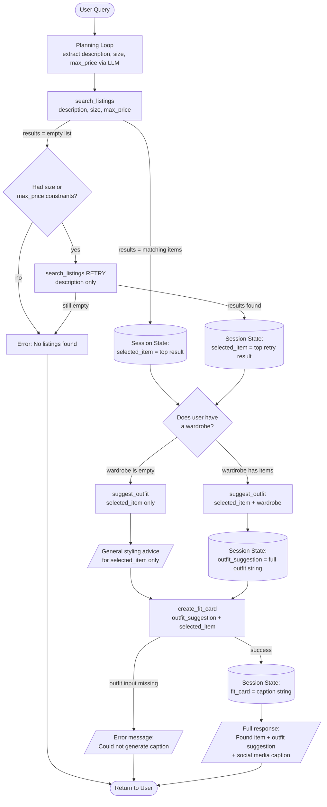

# FitFindr — planning.md

> Complete this document before writing any implementation code.
> Your spec and agent diagram are what you'll use to direct AI tools (Claude, Copilot, etc.) to generate your implementation — the more specific they are, the more useful the generated code will be.
> Your planning.md will be reviewed as part of your submission.
> Update it before starting any stretch features.

---

## Tools

### Tool 1: search_listings

**What it does:**
Searches the mock listings database for clothing items matching the user's request. Filters by price ceiling and size, then ranks remaining results by keyword overlap with the description, returning the most relevant items first.

**Input parameters:**
- `description` (str): A short phrase describing the item the user is looking for (e.g., `"vintage graphic tee"`). Matched against listing `title`, `description`, `style_tags`, and `category` fields.
- `size` (str | None): Size string to filter by, case-insensitive substring match (e.g., `"M"` matches `"S/M"`). Pass `None` to skip size filtering.
- `max_price` (float | None): Maximum price, inclusive (e.g., `30.0`). Pass `None` to skip price filtering.

**What it returns:**
A list of matching listing dicts sorted by relevance score, highest first. Each dict contains:
- `id` (str), `title` (str), `description` (str), `category` (str)
- `style_tags` (list[str]), `colors` (list[str])
- `size` (str), `condition` (str), `price` (float)
- `brand` (str), `platform` (str)

Returns an empty list if nothing matches — never raises an exception.

**What happens if it fails or returns nothing:**
The agent detects the empty list. If `size` or `max_price` were specified, it retries once with only `description` (loosened constraints) and informs the user what was adjusted. If the retry also returns nothing, the agent sets `session["error"]` to a descriptive message and returns early — `suggest_outfit` and `create_fit_card` are never called with empty input.

---

### Tool 2: suggest_outfit

**What it does:**
Given a thrifted item and the user's current wardrobe, generates 1–2 complete outfit suggestions using an LLM. Falls back to general styling advice when the wardrobe is empty, rather than returning an empty result.

**Input parameters:**
- `new_item` (dict): The listing dict for the item the user is considering buying (same structure as a `search_listings` result — includes `title`, `style_tags`, `colors`, `category`).
- `wardrobe` (dict): A wardrobe dict with an `"items"` key holding a list of wardrobe item dicts. Each wardrobe item has `id`, `name`, `category`, `colors` (list[str]), `style_tags` (list[str]), and optional `notes`. The `"items"` list may be empty.

**What it returns:**
A non-empty string. If the wardrobe has items, returns 1–2 specific outfit combinations naming actual wardrobe pieces. If the wardrobe is empty, returns general styling advice — what kinds of items pair well with the new piece and what vibe it suits.

**What happens if it fails or returns nothing:**
If `wardrobe["items"]` is empty, the tool switches to a general-advice prompt automatically. It never returns an empty string or raises an exception.

---

### Tool 3: create_fit_card

**What it does:**
Generates a 2–4 sentence Instagram/TikTok-style caption for the thrifted outfit. Uses a higher LLM temperature (1.2) so the output sounds casual, authentic, and varies across different inputs.

**Input parameters:**
- `outfit` (str): The outfit suggestion string returned by `suggest_outfit`.
- `new_item` (dict): The listing dict for the thrifted item. Used to pull `title`, `price`, and `platform` into the caption naturally (mentioned once each).

**What it returns:**
A 2–4 sentence string usable as a social media caption. Captures the outfit vibe in specific terms, mentions item name, price, and platform once each, and sounds like a real OOTD post rather than a product description.

**What happens if it fails or returns nothing:**
If `outfit` is an empty or whitespace-only string, returns `"Could not generate a caption, no outfit suggestion was provided."` — never raises an exception.

---

### Additional Tools (if any)

None beyond the three required.

---

## Planning Loop

**How does your agent decide which tool to call next?**

After taking in the original user prompt, the agent uses an LLM to extract structured search parameters (description, size, max_price) from natural language. It then calls `search_listings` with those parameters.

**Conditional logic — what the agent checks at each step:**

1. **After `search_listings`:** Check `len(session["search_results"]) == 0`.
   - If empty AND (`session["parsed"]["size"]` is not null OR `session["parsed"]["max_price"]` is not null): retry `search_listings` with description only, notify user what was loosened.
   - If still empty after retry (or constraints were never set): set `session["error"]` and return early. Do NOT proceed to `suggest_outfit`.
   - If results found: select `results[0]` as `session["selected_item"]`, proceed to `suggest_outfit`.

2. **Before `suggest_outfit`:** Check `len(wardrobe["items"]) == 0`.
   - If empty: `suggest_outfit` handles it internally, returns general advice. Agent still calls `create_fit_card` after.
   - If not empty: `suggest_outfit` returns specific outfit combinations using wardrobe pieces.

3. **After `suggest_outfit`:** The agent always calls `create_fit_card` next, because `suggest_outfit` always returns a non-empty string.

4. **After `create_fit_card`:** The agent is done. Return the session dict.

The agent does NOT call all tools unconditionally — it stops early at step 1 if search returns nothing, and `create_fit_card` is only called when there is a real outfit string to work with.

---

## State Management

**How does information from one tool get passed to the next?**

All state for a single interaction lives in a session dict created by `_new_session()` at the start of `run_agent()`. No state is re-entered by the user between tool calls.

| Field | Type | What it stores | When it's set | Used by |
|---|---|---|---|---|
| `query` | str | Original user query | Start of run | LLM parse prompt |
| `parsed` | dict | `{description, size, max_price}` extracted by LLM | After LLM parse | `search_listings` args |
| `search_results` | list[dict] | All matching listings from search | After `search_listings` | Selecting `selected_item` |
| `selected_item` | dict | Top result from search | After step 3 | `suggest_outfit`, `create_fit_card` |
| `wardrobe` | dict | User's wardrobe (passed in at start) | Start of run | `suggest_outfit` |
| `outfit_suggestion` | str | String returned by `suggest_outfit` | After step 5 | `create_fit_card` |
| `fit_card` | str | Caption returned by `create_fit_card` | After step 6 | Final output |
| `error` | str or None | Set if interaction ended early | On any early exit | Returned to caller |

**Key state handoffs:**
- `session["search_results"][0]` → `session["selected_item"]`: the user never re-types the item; the agent picks the best match automatically.
- `session["outfit_suggestion"]` → argument to `create_fit_card`: the outfit string flows forward without re-entry.
- `session["wardrobe"]` is set once at startup and passed into `suggest_outfit`; it never changes mid-run.

---

## Error Handling

For each tool, describe the specific failure mode you're handling and what the agent does in response.

| Tool | Failure mode | Agent response |
|------|-------------|----------------|
| `search_listings` | No results match the query | If size or max_price constraints were present, the agent retries with description only and tells the user: `"No exact matches found. I retried with looser constraints..."`. If still no results, sets `session["error"]` = `"Sorry, I couldn't find any items that matched your description. Please try again or ask for something else."` and returns early. |
| `suggest_outfit` | Wardrobe `"items"` list is empty | Tool switches internally to a general-advice prompt and returns non-empty styling advice. Agent continues to `create_fit_card` normally. |
| `create_fit_card` | `outfit` string is empty or whitespace | Returns `"Could not generate a caption, no outfit suggestion was provided."` — no exception raised, no crash. |

---

## Architecture



---

## AI Tool Plan

**Milestone 3 — Individual tool implementations:**

I used Claude Code to help implement and debug each tool. Two specific instances:

**Instance 1 — search_listings filter logic:**

I said: "I'm making the search_listings tool in @tools.py, and I'm wondering how to safely remove the items from the database during iteration."

Claude responded: "You don't need to remove items during iteration — that's where bugs creep in. Instead, build a new filtered list using a list comprehension, then score what's left:

```python
listings = load_listings()

# Filter first, no mutation
filtered = [
    item for item in listings
    if (max_price is None or item["price"] <= max_price)
    and (size is None or size.lower() in item["size"].lower())
]
```

Then score and sort the filtered list separately. You never touch the original listings — you just select from it. This is safer than removing during iteration (which can skip items or cause index errors) and cleaner than copying then deleting."

I read the snippet, understood the filter-then-score pattern, and verified it against the spec's description of steps 2–4. I then ran the three unit tests in `tests/test_tools.py` to confirm the price filter and empty-result cases both passed before moving on.

**Milestone 4 — Planning loop and state management:**

**Instance 2 — run_agent robustness:**

I said: "Are there any bugs or things to look out for in run_agent?"

Claude flagged three issues: (1) a commented-out error stub that should be deleted, (2) `json.loads` would crash if the LLM prefixed extra text before the JSON — suggested wrapping in `try/except json.JSONDecodeError`, and (3) a style note about using `session["wardrobe"]` consistently. I accepted and applied fixes (1) and (2) directly. For (2), I verified the fix by checking that the LLM prompt explicitly says "Respond with ONLY a JSON object" and confirmed the `try/except` catches the edge case without masking real errors. I left (3) as-is because both references are the same object and behavior is identical — I disagreed with Claude's suggestion here and kept my original code.

After adding retry logic, I asked Claude to confirm the retry branch handled the case where neither `size` nor `max_price` was in the original parsed query (to avoid a pointless retry). Claude confirmed the condition `if parsed.get("size") or parsed.get("max_price")` is the correct guard, and I verified this by testing with the "designer ballgown size XXS under $5" no-results query in the narrated test.

---

## A Complete Interaction (Step by Step)

**Example user query:** "I'm looking for a vintage graphic tee under $30. I mostly wear baggy jeans and chunky sneakers. What's out there and how would I style it?"

**Step 1 — Parse query (Planning Loop):**
The LLM receives the query and extracts `{"description": "vintage graphic tee", "size": null, "max_price": 30.0}`. This is stored in `session["parsed"]`. The tool that gets called: none yet — this is internal planning.

**Step 2 — Call `search_listings`:**
`search_listings("vintage graphic tee", None, 30.0)` is called. All 20+ listings are loaded, those over $30 are dropped, then remaining items are scored by keyword overlap with "vintage graphic tee". Items scoring 0 are dropped. Results sorted highest-first. The top result — *Graphic Tee — 2003 Tour Bootleg Style* at $22.00 on depop — is stored in `session["search_results"]`.

**Step 3 — Select top item:**
`session["selected_item"] = session["search_results"][0]` — the Graphic Tee. No user re-entry.

**Step 4 — Call `suggest_outfit`:**
`suggest_outfit(selected_item, wardrobe)` is called. The wardrobe has 10 items, so the LLM receives a prompt with the new tee plus wardrobe contents and asks for 1–2 specific outfit combinations. The response is stored in `session["outfit_suggestion"]`.

**Step 5 — Call `create_fit_card`:**
`create_fit_card(outfit_suggestion, selected_item)` is called. The LLM generates a 2–4 sentence caption mentioning "Graphic Tee — 2003 Tour Bootleg Style," $22, and depop naturally. Stored in `session["fit_card"]`.

**Final output to user:**
```
Found: Graphic Tee — 2003 Tour Bootleg Style
$22.00 | depop | condition: good

Outfit:
  Pair this tee with your Vintage Levi's 501 Jeans and White Canvas Sneakers
  for a classic streetwear look. Tuck in slightly and add the Crossbody Bag
  for a clean finish.

Caption:
  found this 2003 tour tee on depop for $22 and i cannot stop wearing it.
  levi's + canvas sneakers and it just clicks. vintage streetwear never misses.
```
