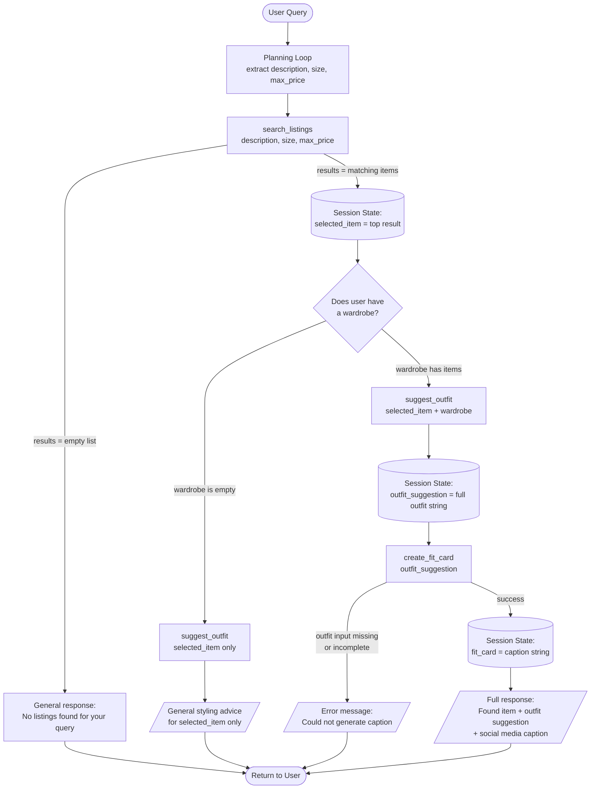

# FitFindr — planning.md

> Complete this document before writing any implementation code.
> Your spec and agent diagram are what you'll use to direct AI tools (Claude, Copilot, etc.) to generate your implementation — the more specific they are, the more useful the generated code will be.
> Your planning.md will be reviewed as part of your submission.
> Update it before starting any stretch features.

---

## Tools

List every tool your agent will use. For each tool, fill in all four fields.
You must have at least 3 tools. The three required tools are listed — add any additional tools below them.

### Tool 1: search_listings

**What it does:**
<!-- Describe what this tool does in 1–2 sentences -->
This searches the listings database for items matching the user's request. For example, there are different attributed to the clothing that can be specified, like a price ceiling, desired style, colors, etc.

**Input parameters:**
<!-- List each parameter, its type, and what it represents -->
- `description` (str): ... requires a breif description of the item being looked for
- `size` (str): ... size of the clothing (if specified)
- `max_price` (float): ... the maximum price the user is willing to spent (if specified)

**What it returns:**
<!-- Describe the return value — what fields does a result contain? -->
it returns a list of items that might fit the input parameters. This would be a list containing multiple dictionaries.

**What happens if it fails or returns nothing:**
<!-- What should the agent do if no listings match? -->
If it finds nothing, it will return an empty list.

---

### Tool 2: suggest_outfit

**What it does:**
<!-- Describe what this tool does in 1–2 sentences -->
Given an item, it suggests a full outfit including that item.

**Input parameters:**
<!-- List each parameter, its type, and what it represents -->
- `new_item` (dict): ... the item the using is considering purchasing
- `wardrobe` (dict): ... a (potentially empty) list of items that can be used to create the outfit card

**What it returns:**
<!-- Describe the return value -->
It returns a string with outfit suggestions. However, if the wardrobe is empty, then it will give general styling advice instead of an outfit.

Maybe a model will be used to make that string, or we can do a simple string with concatenation.

**What happens if it fails or returns nothing:**
<!-- What should the agent do if the wardrobe is empty or no outfit can be suggested? -->
It should give general styling advice for the outfit rather than giving an empty string.

---

### Tool 3: create_fit_card

**What it does:**
<!-- Describe what this tool does in 1–2 sentences -->
It makes a usable caption for the outfit to post on social media

**Input parameters:**
<!-- List each parameter, its type, and what it represents -->
- `outfit` (...): ... The outfit suggestion string that is returned from suggest_outfit

**What it returns:**
<!-- Describe the return value -->
It returns a short social media caption that can be used to post the outfit on social media

**What happens if it fails or returns nothing:**
<!-- What should the agent do if the outfit data is incomplete? -->
return a descriptive error message instead of an actual code breaking error. 

---

### Additional Tools (if any)

<!-- Copy the block above for any tools beyond the required three -->

---

## Planning Loop

**How does your agent decide which tool to call next?**
<!-- Describe the logic your planning loop uses. What does it look at? What conditions change its behavior? How does it know when it's done? -->
After taking in the original user prompt, it searches for the description of the item they're looking for (eg. vintage tee, baggy jeans, etc). It can do this by maybe looking for keywords like styles (y2k, preppy, etc) or clothes (shirt, jeans, etc). It then takes the concise description and calls the `search_listings` tool to search through the clothes database.

If it doesn't find at least one relevant item, then the model stops calling tools and instead gives a general response about their prompt.

If it finds at least one item, it takes the most relevant one and then takes the user's wardrobe to call `suggest_outfit`. If wardrobe is empty, then it will cut off the tool early and return a string with general advice about how to style the specific item. It will stop calling tools. However, If the wardrobe isn't empty, it will pair it with items that are similar to the item the user is looking at.

If the last tool call was able to use an entire wardrobe to style the item, it will proactively generate a caption for social media and append it to its final response. That will be the final tool call before listening to the user's next request.

---

## State Management

**How does information from one tool get passed to the next?**
<!-- Describe how your agent stores and accesses state within a session. What data is tracked? How is it passed between tool calls? -->

---

## Error Handling

For each tool, describe the specific failure mode you're handling and what the agent does in response.

| Tool | Failure mode | Agent response |
|------|-------------|----------------|
| search_listings | No results match the query | Returns an empty list|
| suggest_outfit | Wardrobe is empty | returns a string with general styling advice for the item, not the whole wardrobe |
| create_fit_card | Outfit input is missing or incomplete | Says "Could not generate a caption, no outfit suggestion was provided." |

---

## Architecture



---

## AI Tool Plan

<!-- For each part of the implementation below, describe:
     - Which AI tool you plan to use (Claude, Copilot, ChatGPT, etc.)
     - What you'll give it as input (which sections of this planning.md, your agent diagram)
     - What you expect it to produce
     - How you'll verify the output matches your spec before moving on

     "I'll use AI to help me code" is not a plan.
     "I'll give Claude my Tool 1 spec (inputs, return value, failure mode) and ask it to implement
     search_listings() using load_listings() from the data loader — then test it against 3 queries
     before trusting it" is a plan. -->

**Milestone 3 — Individual tool implementations:**

For the tool implementation, I'm using Claude Code to help me with planning to avoid errors in the future, to check my work, give me example code snippets, and to break down steps into smaller actionable goals.

Examples of a prompt: 

I said: "I'm making the search_listings tool in @tools.py , and I'm wondering how to safely remove the items from the database during iteration."

It responded: "You don't need to remove items during iteration — that's where bugs creep in. Instead, build a new filtered list using a list comprehension, then score what's left:

```python
listings = load_listings()

# Filter first, no mutation
filtered = [
    item for item in listings
    if (max_price is None or item["price"] <= max_price)
    and (size is None or size.lower() in item["size"].lower())
]
```

Then score and sort the filtered list separately. You never touch the original listings — you just select from it. This is safer than removing during iteration (which can skip items or cause index errors) and cleaner than copying then deleting."

I looked at exactly what that code snipped was doing, understood it, and checked if the output was actually correct.

**Milestone 4 — Planning loop and state management:**

---

## A Complete Interaction (Step by Step)

Write out what a full user interaction looks like from start to finish — tool call by tool call. Use a specific example query.

**Example user query:** "I'm looking for a vintage graphic tee under $30. I mostly wear baggy jeans and chunky sneakers. What's out there and how would I style it?"

**Step 1:**
Take the user's inquiry and look for items that match the user's description by calling `search_listings`. If it finds
a relevant item, then we can move onto step 2 by taking the most relevant item. Otherwise, we'll respond with a general response but nothing specific. 

**Step 2:**
Using the most relevant item paired with the user's wardrobe, it'll craft an outfit and move onto step 3. If the user's wardrobe is empty, then it will give general styling advice for the specific item, but not a whole outfit.

**Step 3:**
If it's able to make a whole outfit, it'll draft a social media caption to go along with the outfit for if the user wants to post it.

**Final output to user:**
"I found this shirt just for you from [brand] and it costs [price]! I've put together a potential outfit to go with it: [item1], [item2], etc. And if you'd like to share, here's a caption I drafted: '[insert caption]'."
